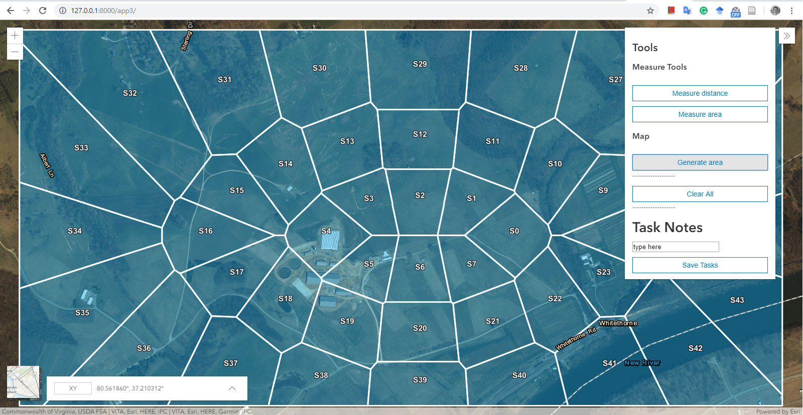

# SAR Web User Interface Demo

[more examples](screen/)
## Built based on 
- DJango as sever
- ESRI js development platform, 
- d3 for polygon and voronoi. 
- SQLite as database
- DJango REST freamwork is needed

User interface demo: [https://sites.google.com/vt.edu/vacsesardemo](https://sites.google.com/vt.edu/vacsesardemo/home)

Reference
[ESRI Javascript API](https://developers.arcgis.com/javascript/latest/api-reference/esri-views-View.html#width)

URL
http://127.0.0.1:8000/app3/

-----------2019 05 17 ------------
1. Setup
[Django REST framework](https://www.django-rest-framework.org/tutorial/quickstart/)

pip install djangorestframework

In settings:

INSTALLED_APPS = [
    ...
    'rest_framework',
    ...
]

2. Stream GPS data to database:

Step 1) Post a new device

Step 2) Update GPS data

Code in python:  
```python
import requests

# create a new device, deviceis is the primary key
r = requests.post('http://127.0.0.1:8000/app3/gpsdatas/', data = {'deviceid':'max_testing', 'taskid':'sar_put2','gpsdata':'{"gps":["stamp":004,"lat":-81,"log":37]}'})

# update record based on primary key. For example: "./max_testing/" is added as pk
r = requests.patch('http://127.0.0.1:8000/app3/gpsdatas/max_testing/', data = {'deviceid':'max_testing', 'taskid':'sar_put2','gpsdata':'{"gps":["stamp":004,"lat":-80,"log":38]}'})
```

3. Operate in browser:
Open the link in chrome: http://127.0.0.1:8000/app3/gpsdatas/


Updates Log
--------------Nov------------------
1. Need to find the algrithm of generating convex polygon based on multi-points.
2. Add function of marking

-----------2019 02 18---------------
esri javascript
polygon
sketchviewmodel

Testing URL: http://127.0.0.1:8000/app3/sketch
